# STRATA — Distributed Hybrid Search Engine

STRATA is a search engine built from search fundamentals rather than around an existing search platform.

It started with text analysis, an inverted index, and BM25, and evolved into a distributed search system with persistent shards, Kafka-driven indexing, semantic retrieval, hybrid ranking, and a Next.js interface.

The interesting part is not any single algorithm. It is the path between them:

**How does a crawled page become a versioned document? How does that change reach an indexer? How is the document assigned to a shard? How are lexical and semantic indexes maintained together? And how do multiple remote shards contribute to one global result set?**

STRATA is intentionally built as a production-style distributed systems project for learning, experimentation, and demonstrating real engineering concepts. It is designed around service boundaries, persistence, asynchronous processing, and failure handling rather than being a simple search API wrapper.

---

## Screenshots

### Home

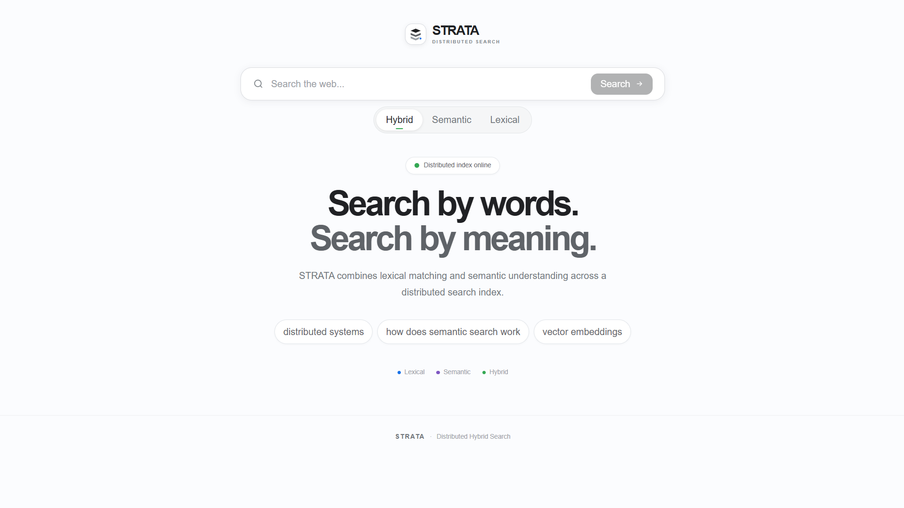

### Search Results

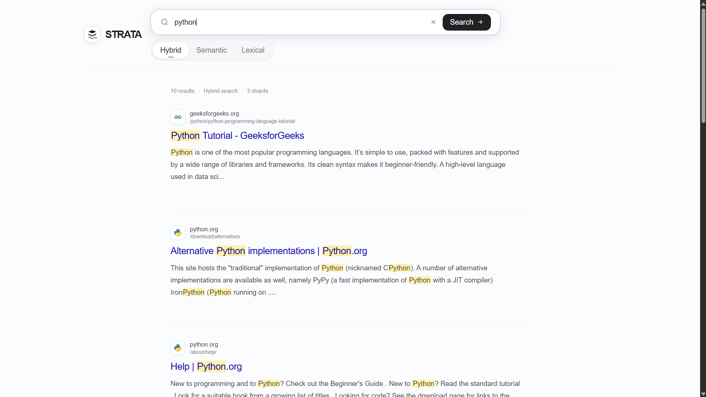

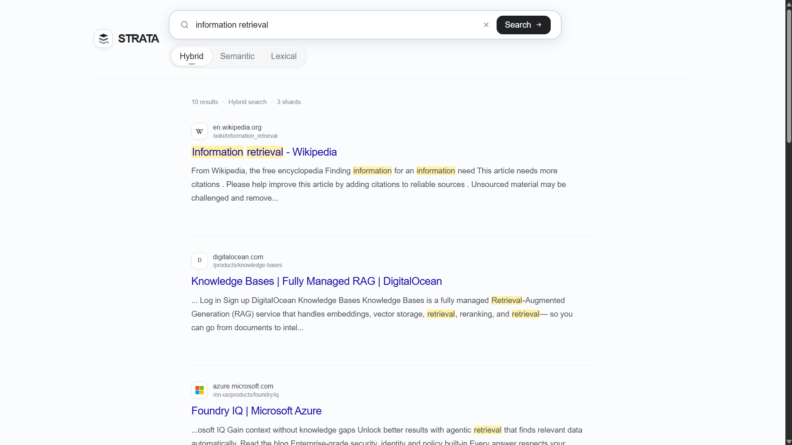

---

# What STRATA Can Do

### Search

* Lexical search with an inverted index and BM25 ranking
* Semantic search using Sentence Transformer embeddings
* Hybrid lexical + semantic retrieval
* Distributed candidate expansion before global ranking
* Global top-k result selection
* Document deduplication during distributed result merging
* Deterministic ranking tie-breaking

### Distributed System

* Consistent-hash document routing across shards
* Independent HTTP shard services
* Parallel remote shard retrieval
* Bounded shard retries and timeouts
* Shard health reporting
* Partial search when some shards fail or time out
* Strict search mode that rejects incomplete distributed results

### Indexing and Persistence

* Same-domain web crawling with URL normalization
* Document cleaning and PostgreSQL persistence
* Change detection using document content hashes and versions
* Inverted lexical indexes
* Immutable index segments
* Persistent shard generations and manifests
* Atomic manifest publication and startup recovery
* Persistent semantic/vector index data alongside lexical index data
* Bulk bootstrap/reconciliation for missing shard state

### Event-Driven Indexing

* Kafka document change events
* Consumer-group based indexer workers
* At-least-once event handling
* Processed-event tracking for duplicate protection
* Indexed document versions for stale-event protection
* Bounded retries
* Dead-letter queue handling for events that cannot be processed

### Frontend

* Next.js / React search interface
* STRATA branding
* Lexical, Semantic, and Hybrid search modes
* Search result cards with title, URL, favicon, and snippets
* Loading, error, empty-result, and partial-result states
* Shard status information in search results

---

# Architecture

At a high level, STRATA separates ingestion, durable document storage, asynchronous indexing, shard ownership, distributed retrieval, and presentation.

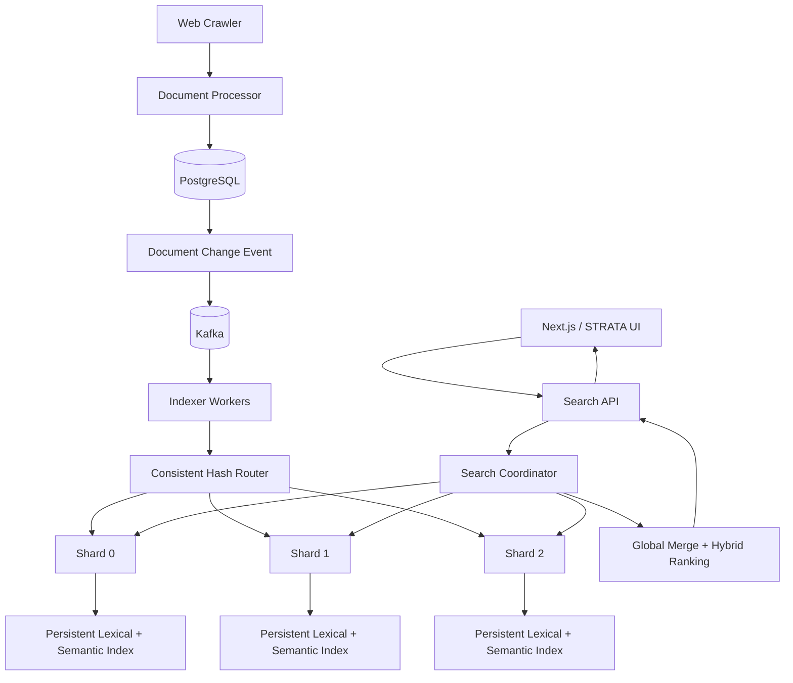

A few boundaries are deliberate:

* **PostgreSQL** is the canonical document store. Search indexes are derived state.
* **Kafka** carries document changes from storage into indexing workers instead of coupling crawling directly to shard mutation.
* **Indexer workers** analyze and embed documents, then route them to the owning shard.
* **Shard services** own their local lexical and semantic indexes and persistent generations.
* **The search coordinator** communicates with shards through a common client boundary.
* **The Next.js frontend** communicates with the Search API rather than reaching directly into search internals.

---

# Indexing Workflow

A crawled page and a searchable index are intentionally separate stages.

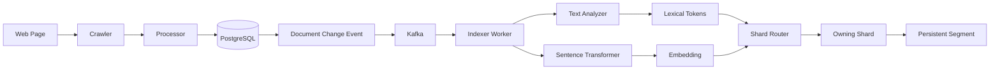

### 1. Crawl

The crawler starts from one or more URLs, stays on the starting domain, removes URL fragments, avoids duplicate URLs, and extracts a page title, main textual content, and links.

The crawler also contains handling for Wikipedia-specific pages and skips `Special:` pages when crawling Wikipedia.

### 2. Process and Store

The processor performs lightweight text cleanup such as whitespace normalization.

The resulting document is written to PostgreSQL.

Storage determines whether the document is:

* created
* updated
* unchanged

Each document maintains a content hash and version.

### 3. Publish the Change

Created and updated documents produce document-change events.

The event contains information such as:

* document identity
* URL
* content hash
* event version
* event type

Unchanged documents do not need another indexing event.

### 4. Consume and Index

Indexer workers consume the Kafka topic as a consumer group.

For each event, the worker:

1. Loads the canonical document from PostgreSQL.
2. Analyzes the searchable text.
3. Generates a semantic embedding.
4. Determines the owning shard.
5. Updates the shard's lexical and semantic indexes.

### 5. Persist the Shard

A shard maintains both its inverted index and vector index.

Mutations are written as a new immutable segment and the shard manifest is atomically replaced to publish the new generation.

There is also a bulk bootstrap path for reconciling PostgreSQL with shards when derived shard state is missing.

---

# Lexical Search

The lexical search path is deliberately built from classical information retrieval concepts:

```text
User Query
    ↓
Text Analysis
    ↓
Inverted Index
    ↓
Candidate Documents
    ↓
BM25
    ↓
Ranked Results
```

`TextAnalyzer` performs:

* Unicode normalization
* tokenization
* stopword removal
* English Snowball stemming

The same analysis approach is used for indexed document text and search queries.

The inverted index stores postings for each term, including term frequency and positions, along with document lengths.

`BM25Ranker` then scores retrieved candidates using:

* term frequency
* document frequency
* document length
* average document length
* BM25 parameters

In the distributed system, ranking is performed locally at each shard before the coordinator merges returned candidates.

---

# Semantic Search

STRATA uses a **Sentence Transformer** model to transform document text and search queries into vectors.

The current implementation uses:

```text
sentence-transformers/all-MiniLM-L6-v2
```

and generates normalized embeddings.

## Document Indexing

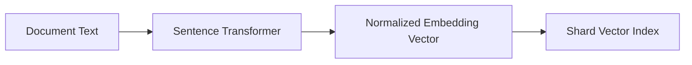

## Query Retrieval

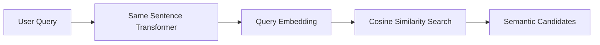

The coordinator embeds a semantic query once and sends that vector to the participating shards.

Each shard performs nearest-neighbor retrieval using cosine similarity over its local `VectorIndex`.

### No External Vector Database

STRATA currently does **not** use a separate vector database.

Embeddings are stored as part of the shard's persistent index data.

The vector index is loaded into memory when a shard starts, while its persistent state is stored through the shard's segment format.

This keeps semantic retrieval aligned with the existing shard architecture rather than introducing another external infrastructure dependency.

The current implementation favors correctness and a simple architecture over approximate-nearest-neighbor performance.

That leaves room for a future ANN implementation without changing the higher-level search contract.

---

# Hybrid Search

Hybrid search is where lexical and semantic retrieval meet.

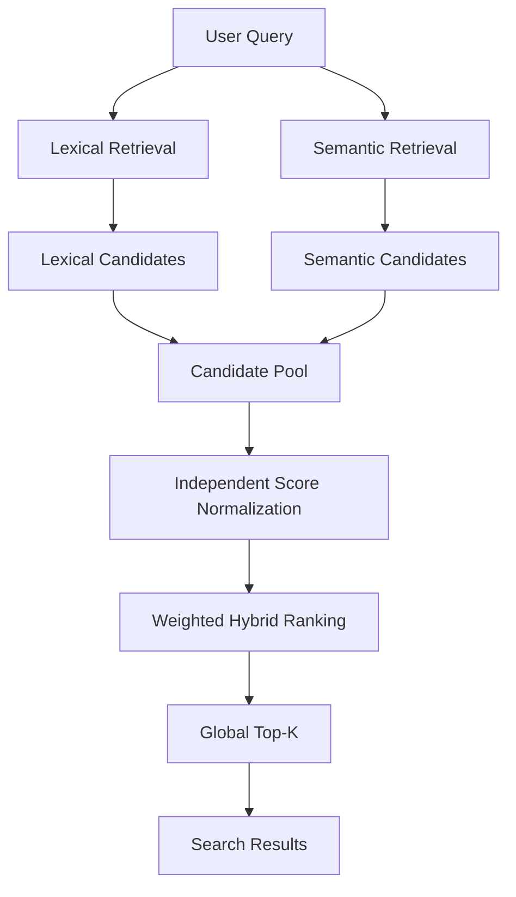

Lexical retrieval is useful when the query and document share important terms.

Semantic retrieval can connect text that expresses a similar idea without sharing the same wording.

STRATA keeps both signals instead of forcing one retrieval method to handle every query.

The current `HybridRanker` independently normalizes lexical and semantic scores and then combines them using configurable weights.

The default weights are equal after normalization.

Documents missing from one retrieval source receive a score of `0.0` for that source.

---

# Distributed Hybrid Search

Distributed hybrid search requires more than simply asking every shard for the final `K` results.

If every shard only returns `K` results, a document that should belong in the global top-k may be hidden behind other local results.

STRATA therefore performs **candidate expansion** before the final global ranking stage.

The current default policy requests:

```text
max(final_limit × 5, 50)
```

candidates per shard, with an optional maximum.

This provides an oversampling window that gives the coordinator more candidates to work with before producing the final global ranking.

The distributed flow is:

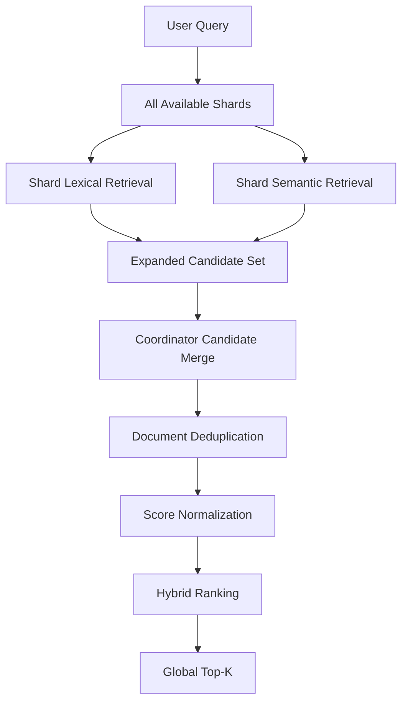

After retrieval, the coordinator combines candidates from all participating shards.

Document IDs are treated as the document identity for merging, so the same document appearing on multiple shards is deduplicated before the final global ranking.

---

# Distributed Search

A search request is fanned out to configured shards and their results are merged centrally.

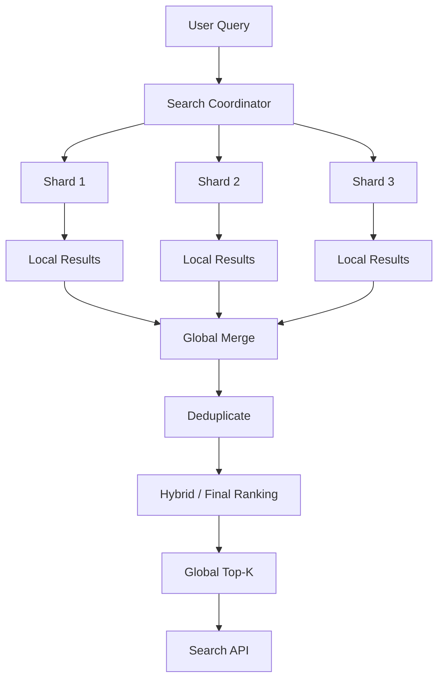

Documents are assigned to shards using deterministic SHA-256 based consistent hashing with virtual nodes.

The same routing abstraction is used by distributed indexers and the shard ownership model.

At query time, the coordinator uses remote shard clients and executes shard searches concurrently.

Each shard performs local retrieval and returns a bounded result set.

The coordinator then merges those responses into one global response returned by the Search API.

## Default Shards

| Shard     | Host Port | Internal Port |
| --------- | --------: | ------------: |
| `shard-0` |    `8100` |        `8001` |
| `shard-1` |    `8101` |        `8001` |
| `shard-2` |    `8102` |        `8001` |

The shard services are independently addressable.

The coordinator does not need to own the shard's index implementation; it only depends on the shard search contract.

---

# Failure Handling

Distributed search is useful only if the system has defined behavior for partial failure.

STRATA handles failure at both the indexing and query layers.

## Query-Side Failures

For each shard, the coordinator tracks:

* success
* failure
* timeout

Remote shard errors can be retried when the client marks them as retryable, and retries are bounded by configuration.

The coordinator supports two behaviors.

### Partial Mode

Successful shard results remain usable when another shard fails or times out.

The API marks the response as partial and reports shard failure or timeout information.

### Strict Mode

Any shard failure or timeout causes the distributed search to fail instead of returning an incomplete result set.

The frontend surfaces this state rather than silently presenting an incomplete response as a fully successful query.

## Indexing-Side Failures

Kafka consumers use manual offset commits.

The worker protects against common at-least-once delivery problems using:

* processed event IDs
* indexed document versions
* document versions
* content hashes
* bounded event retries
* dead-letter queue handling

This matters when events arrive more than once or when an older event is delivered after a newer document version has already been indexed.

## Persistent Recovery

Each shard publishes a manifest pointing at its active immutable segment generation.

Segment data is written before the manifest is replaced, and manifest replacement is atomic.

On startup, the shard loads the currently published generation and restores both lexical and semantic index state.

The manifest therefore acts as the publication point for a shard generation.

---

# End-to-End Search Workflow

From the user's perspective, the complete search path looks like this:

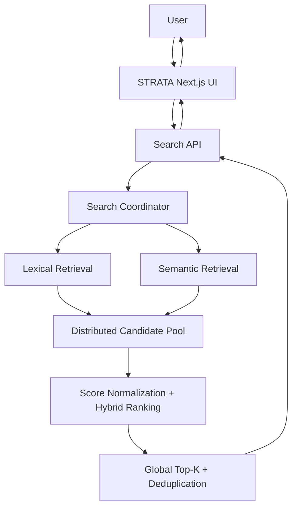

The API supports three search modes:

| Mode       | Retrieval                                           |
| ---------- | --------------------------------------------------- |
| `lexical`  | Inverted index + BM25                               |
| `semantic` | Sentence Transformer embeddings + cosine similarity |
| `hybrid`   | Lexical + semantic retrieval + score fusion         |

The frontend requests document metadata as part of its search call so results can display:

* crawled title
* URL
* favicon
* deterministic content snippet
* search metadata
* shard status

---

# Five-Phase Development

The project has been built progressively in five phases.

The original phase structure is intentionally preserved because the repository history contains commits corresponding to these milestones.

## Phase 1 — Search Engine Fundamentals

Built the classical search foundation:

* text analysis
* inverted indexing
* term statistics
* BM25 ranking
* query handling
* initial Search API

**Outcome:** a working local lexical search engine built from first principles.

---

## Phase 2 — Scalable Search Foundation

Added:

* web crawling
* PostgreSQL-backed document storage
* document change detection
* persistent indexes
* immutable segments
* segment management and merging
* sharding
* consistent hashing
* shard-local search
* persistent shard metadata
* recovery

**Outcome:** the search engine became a persistent, sharded system instead of a single in-memory index.

---

## Phase 3 — Real Distributed System

Introduced:

* Kafka document events
* consumer groups
* distributed indexer workers
* event retries
* dead-letter queue handling
* idempotency
* event-version protection
* remote HTTP shard services
* distributed query execution
* shard health
* retries
* timeouts
* strict and partial search semantics

**Outcome:** Phase 3 is complete and frozen.

The system now has real service boundaries for indexing and distributed retrieval rather than only simulating them inside one process.

---

## Phase 4 — Semantic & Hybrid Search

Added:

* Sentence Transformer embeddings
* persistent vector indexes
* semantic retrieval
* distributed semantic search
* hybrid score fusion
* distributed candidate expansion
* document deduplication
* global top-k behavior

**Outcome:** STRATA can search by exact lexical relevance, semantic similarity, or a combination of both.

---

## Phase 5 — Production, Observability & UX

The final phase focuses on production-oriented improvements around:

* observability
* benchmarking
* failure testing
* documentation
* user experience

The current implementation also includes a functional **Next.js search UI** with:

* STRATA branding
* multiple search modes
* search result cards
* snippets
* loading and error states
* distributed/partial-result status

Observability, deeper benchmarking, and additional production-oriented work remain future scope rather than being presented as completed features.

---

# Project Structure

The repository is organized around service boundaries rather than putting the entire application inside the Search API.

```text
project/
├── frontend/
│   ├── app/
│   ├── components/
│   ├── lib/
│   └── types/
│
├── services/
│   ├── bootstrap/       # Bulk shard reconciliation/bootstrap
│   ├── crawler/         # Web crawling and page extraction
│   ├── events/          # Kafka producers and consumers
│   ├── indexer/         # Analysis, indexes, shards, persistence, workers
│   ├── pipeline/        # Crawl → storage → event orchestration
│   ├── processor/       # Document cleaning
│   ├── search/          # Retrieval, ranking, coordination, shard clients
│   ├── search_api/      # Public FastAPI search API and DB setup
│   ├── semantic/        # Embedding model, vector index, similarity
│   ├── shard/           # Independent persistent shard HTTP service
│   └── storage/         # PostgreSQL persistence and indexing state
│
├── libs/
│   ├── common/          # Shared events, Kafka config, version logic
│   └── models/          # SQLAlchemy document/data models
│
├── tests/
│   └── integration/     # Cross-service and real 
│
├── architecture.md
├── crawl_sites.py
├── docker-compose.yml
├── Dockerfile
├── requirements.txt
└── README.md
```

The important distinction is:

**PostgreSQL stores canonical documents, while shards store derived search state.**

Kafka connects those two worlds asynchronously.

---

# Tech Stack

| Area                     | Technology                                                                        |
| ------------------------ | --------------------------------------------------------------------------------- |
| Backend                  | Python 3.12, FastAPI, SQLAlchemy                                                  |
| Database                 | PostgreSQL 17                                                                     |
| Messaging                | Apache Kafka 4.0, `confluent-kafka`                                               |
| Search                   | Inverted Index, BM25, Semantic Retrieval, Hybrid Ranking                          |
| NLP / Embeddings         | NLTK Snowball Stemmer, Sentence Transformers, `all-MiniLM-L6-v2`                  |
| Distributed Architecture | Sharding, Consistent Hashing, Remote HTTP Shard Services, Distributed Coordinator |
| Persistence              | Immutable shard segments + atomic manifests                                       |
| Frontend                 | Next.js 16, React 19, TypeScript, Tailwind CSS                                    |
| Containers               | Docker, Docker Compose                                                            |
| Testing                  | Pytest                                                                            |

---

# Running STRATA Locally

STRATA uses Docker Compose for the backend infrastructure and services, while the frontend runs locally with Next.js.

## Prerequisites

Make sure you have the following installed:

* Docker
* Docker Compose
* Node.js and npm
* Python 3.12+

---

## 1. Clone the Repository

```cmd
git clone https://github.com/deepakMali2005/distributed-search-engine.git
cd distributed-search-engine
```

---

## 2. Create Your Environment File

The repository includes a `.env.example` file containing the environment variables required by the project.

Create your own `.env` file from the example.

### Windows CMD

```cmd
copy .env.example .env
```

### macOS / Linux

```bash
cp .env.example .env
```

Then open `.env` and configure the values for your local environment if needed.

> **Do not commit your `.env` file.** It may contain local credentials, database configuration, or other environment-specific values. The `.env.example` file is provided as the safe template to share with the repository.

---

## 3. Start the Backend

From the project root, build and start the Docker Compose stack:

```cmd
docker compose up --build -d
```

This starts the main backend infrastructure and services, including:

* PostgreSQL
* Kafka
* Kafka initialization
* Search API
* Indexer worker
* Shard 0
* Shard 1
* Shard 2
* Index bootstrap / reconciliation

Check the running containers with:

```cmd
docker compose ps
```

The main local endpoints are:

```text
Search API : http://localhost:8000
Shard 0    : http://localhost:8100
Shard 1    : http://localhost:8101
Shard 2    : http://localhost:8102
```

> **Note:** The first startup can take longer because the Sentence Transformer model may need to be downloaded and cached.

---

## 4. Start the Frontend

Open a **new terminal** and move into the frontend directory:

```cmd
cd frontend
```

Install the frontend dependencies:

```cmd
npm install
```

Start the Next.js development server:

```cmd
npm run dev
```

The frontend will be available at:

```text
http://localhost:3000
```

Open that URL in your browser to use STRATA.

---

## 5. Crawl Documents

Once the backend is running, documents can be added through the crawler.

From the project root:

```cmd
python crawl_sites.py https://example.com --max-pages 10
```

Multiple starting URLs can also be provided:

```cmd
python crawl_sites.py https://example.com https://www.python.org --max-pages 10
```

Or use a file containing URLs:

```cmd
python crawl_sites.py --file sites.txt --max-pages 10
```

The crawl pipeline is:

```text
Website
   ↓
Crawler
   ↓
Processor
   ↓
PostgreSQL
   ↓
Kafka Document Event
   ↓
Indexer Worker
   ↓
Consistent Hashing
   ↓
Owning Shard
   ↓
Lexical + Semantic Index
```

---

## 6. Run Tests

From the project root:

```cmd
pytest -q
```

The test suite covers:

* search fundamentals
* inverted indexing
* BM25
* semantic retrieval
* vector indexing
* hybrid ranking
* Kafka events
* event versions
* indexer workers
* shard persistence
* HTTP shard clients
* distributed search
* failure handling
* strict/partial search
* end-to-end distributed hybrid search

---

## Stopping the Project

To stop the Docker Compose services:

```cmd
docker compose down
```

To stop the services and remove their associated volumes:

```cmd
docker compose down -v
```

> **Warning:** `docker compose down -v` removes persisted local Docker volumes, including PostgreSQL and service data.

---

# Testing Strategy

The tests are organized around the same boundaries as the implementation rather than relying only on one large end-to-end test.

### Search Fundamentals

* analyzer
* query processing
* inverted index
* retrieval
* BM25 ranking

### Persistence

* immutable segments
* segment management
* merging
* shard persistence
* manifests
* recovery

### Sharding

* consistent-hash routing
* shard ownership
* shard-local search

### Semantic Search

* embedding models
* vector indexes
* cosine similarity
* semantic retrieval

### Hybrid Search

* score normalization
* score fusion
* candidate expansion
* global top-k
* deduplication

### Distributed Behavior

* coordinator
* remote shard clients
* HTTP shard services
* retries
* timeouts
* strict/partial search

### Event Pipeline

* Kafka configuration
* producers
* consumers
* duplicate events
* event versions
* processed-event tracking
* DLQ behavior

### Integration

* Kafka workers
* shard processes
* HTTP search
* health checks
* persistence across process boundaries
* distributed hybrid search

---

# Engineering Highlights

## Derived Indexes with a Canonical Source of Truth

PostgreSQL owns the document record.

Search indexes are derived state that can be rebuilt or reconciled from the canonical document store.

This separation makes indexing failures easier to reason about than treating the search index itself as the primary data store.

---

## Immutable Shard Generations

A shard does not overwrite the currently published generation in place.

Instead it:

1. writes a new segment
2. creates the next manifest generation
3. atomically publishes the manifest

Startup recovery can therefore load the last successfully published generation.

---

## Event-Driven Indexing

The crawler does not need to know which shard should receive a document.

It stores the document and emits a change event.

Indexer workers consume those events, analyze and embed the document, and use consistent hashing to determine the owning shard.

---

## At-Least-Once Event Safety

Kafka delivery can repeat events or deliver them after another version.

STRATA uses:

* processed-event IDs
* indexed document versions
* document versions
* content hashes

to reject duplicate and stale events without blindly applying every message.

---

## Semantic Retrieval Without a Separate Vector Database

The vector index is part of the shard rather than an external service.

This keeps semantic retrieval aligned with shard ownership and persistence while leaving the vector-index interface replaceable in the future.

---

## Distributed Hybrid Ranking

The coordinator does more than concatenate shard results.

It:

1. expands candidate windows
2. collects lexical and semantic candidates
3. normalizes scores
4. deduplicates documents
5. performs hybrid ranking
6. produces the final global top-k

---

## Explicit Failure Semantics

Timeouts, retryable shard errors, failed shards, and partial results are represented in the search response.

This makes distributed failure visible to API clients and the frontend instead of presenting a degraded query as a normal successful response.

---

# Roadmap

Future improvements include:

* Search suggestions / autocomplete
* Relevance datasets and systematic ranking evaluation
* Better query understanding
* Prometheus / Grafana metrics
* Structured operational telemetry
* Distributed tracing
* Load and latency benchmarking at larger corpus sizes
* Further frontend UX improvements
* Experiments with more advanced vector retrieval
* Reranking models

These are future improvements rather than currently completed features.

---

# Project Story

STRATA was built progressively from information retrieval fundamentals into a distributed hybrid search system.

```text
Information Retrieval
        ↓
Text Analysis + Inverted Index
        ↓
BM25 Search
        ↓
Persistent Indexes
        ↓
Immutable Segments
        ↓
Sharding + Consistent Hashing
        ↓
Distributed Search
        ↓
Kafka-Based Indexing
        ↓
Independent Shard Services
        ↓
Semantic Search
        ↓
Hybrid Retrieval + Ranking
        ↓
Global Top-K
        ↓
Next.js Search Interface
```

The project is intentionally focused on understanding and implementing the underlying systems rather than wrapping an existing search engine.

The result is a distributed search engine that combines **classical information retrieval, semantic search, event-driven indexing, persistent sharding, distributed query execution, and a modern web interface** in one system.

---

## License

This project is intended primarily as a learning, experimentation, and portfolio project.
