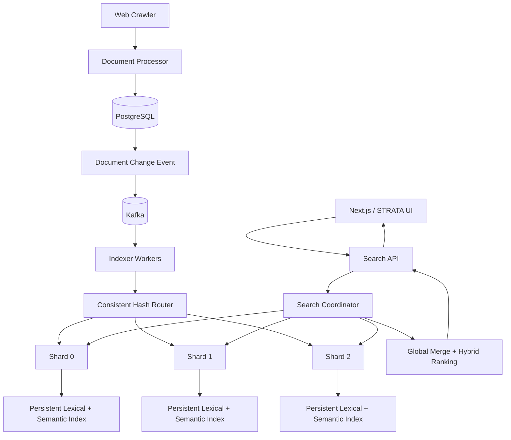
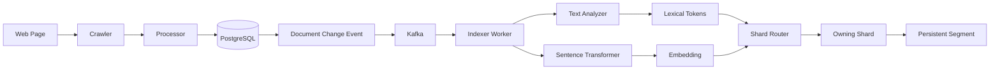
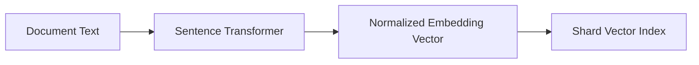
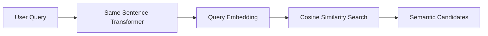
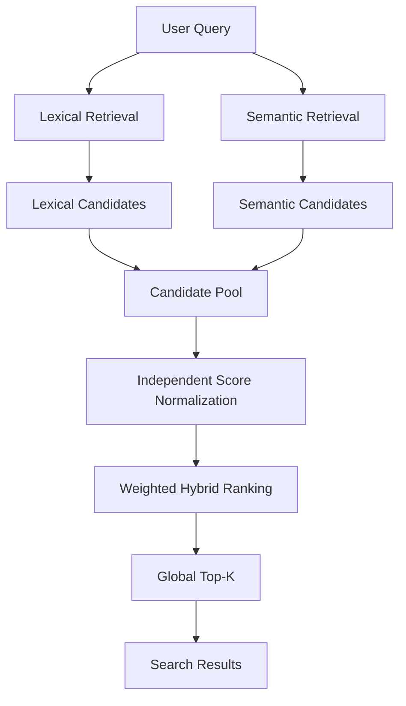
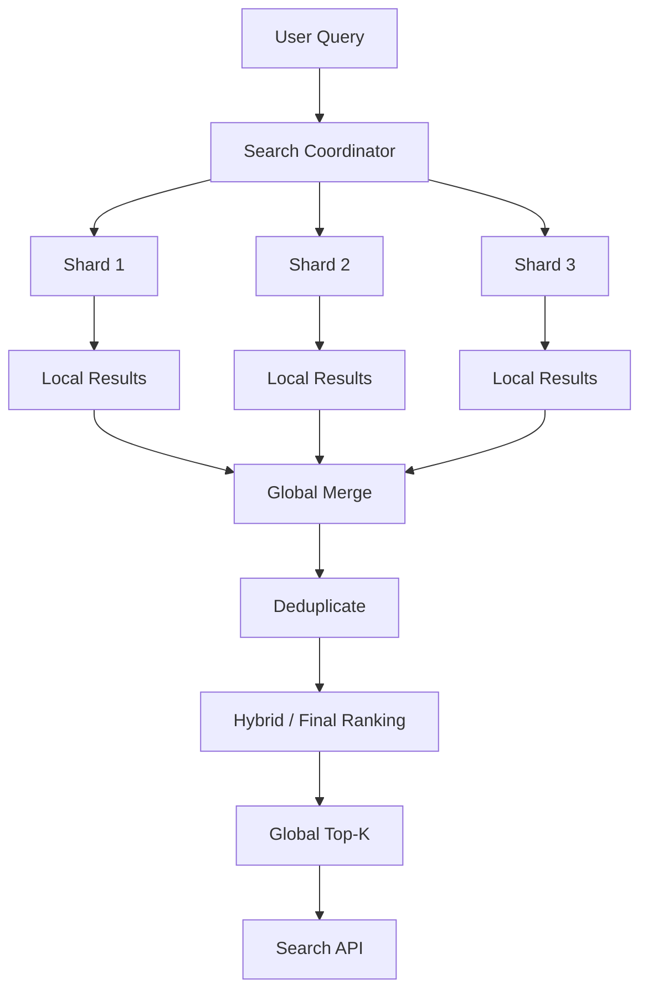
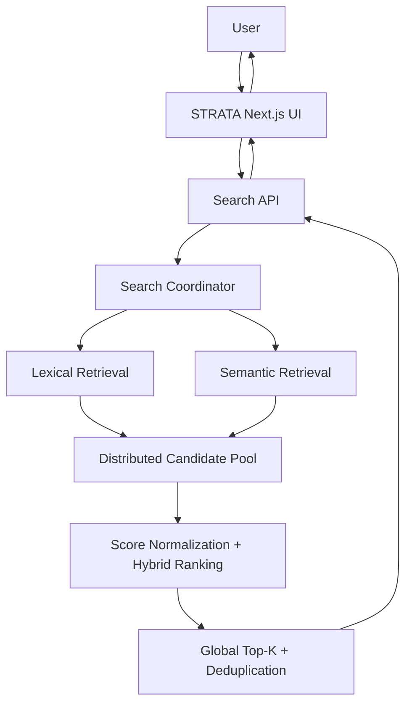

# STRATA — Distributed Hybrid Search Engine

STRATA is a search engine built from the search fundamentals up rather than around an existing search platform. It started with text analysis, an inverted index, and BM25, and has grown into a distributed system with persistent shards, Kafka-driven indexing, semantic retrieval, hybrid ranking, and a Next.js interface.

The interesting part is not any single algorithm. It is the path between them: how a crawled page becomes a versioned document, how that change reaches an indexer, how the document is assigned to a shard, how lexical and semantic indexes are maintained together, and how several remote shards can contribute to one global result set.

The project is intentionally built as a production-style system for learning and experimentation. It is designed around real service boundaries and failure cases, but it is not presented as a production-scale search service.

---

## What STRATA Can Do

### Search

* Lexical search with an inverted index and BM25 ranking
* Semantic search using sentence-transformer embeddings
* Hybrid lexical + semantic retrieval
* Distributed candidate expansion before global ranking
* Global top-k result selection
* Document deduplication during distributed result merging
* Deterministic ranking tie-breaking

### Distributed system

* Consistent-hash document routing across shards
* Independent HTTP shard services
* Parallel remote shard retrieval
* Bounded shard retries and timeouts
* Shard health reporting
* Partial search when some shards fail or time out
* Strict search mode that rejects incomplete distributed results

### Indexing and persistence

* Same-domain web crawling with URL normalization
* Document cleaning and PostgreSQL persistence
* Change detection using document content hashes and versions
* Inverted lexical indexes
* Immutable index segments
* Persistent shard generations and manifests
* Atomic manifest publication and startup recovery
* Persistent semantic/vector index data alongside lexical index data
* Bulk bootstrap/reconciliation for missing shard state

### Event-driven indexing

* Kafka document change events
* Consumer-group based indexer workers
* At-least-once event handling
* Processed-event tracking for duplicate protection
* Indexed document versions for stale-event protection
* Bounded retries
* Dead-letter queue handling for events that cannot be processed

### Frontend

* Next.js / React search interface
* STRATA branding
* Lexical, Semantic, and Hybrid search modes
* Search result cards with title, URL, favicon, and snippets
* Loading, error, empty-result, and partial-result states
* Shard status information in search results

---

## Architecture

At a high level, STRATA separates ingestion, durable document storage, asynchronous indexing, shard ownership, distributed retrieval, and presentation.



A few boundaries are deliberate:

* **PostgreSQL** is the canonical document store. The search indexes are derived state.
* **Kafka** carries document changes from storage into the indexing workers instead of coupling crawling directly to shard mutation.
* **Indexer workers** analyze and embed documents, then route them to the owning shard.
* **Shard services** own their local lexical and semantic indexes and their persistent generations.
* **The search coordinator** treats shards through a common client boundary, so the distributed search path works with remote HTTP shard services.
* **The Next.js frontend** talks to the Search API through its own server-side API route rather than reaching into the search internals directly.

---

## Indexing Workflow

A crawled page and a searchable index are intentionally separate stages. Crawling discovers and extracts pages; indexing turns the stored document into search structures.



### 1. Crawl

The crawler starts from one or more URLs, stays on the starting domain, removes URL fragments, avoids duplicate URLs, and extracts a page title, main textual content, and links. It also skips Wikipedia `Special:` pages when crawling Wikipedia.

### 2. Process and store

The processor currently performs lightweight text cleanup such as whitespace normalization. The resulting document is written to PostgreSQL. Storage determines whether the document is **created**, **updated**, or **unchanged** and maintains its content hash and version.

### 3. Publish the change

Created and updated documents produce document-change events. The event contains the document identity, URL, content hash, event version, and event type. Unchanged documents do not need another indexing event.

### 4. Consume and index

Indexer workers consume the Kafka topic as a consumer group. For each event, the worker loads the canonical document from PostgreSQL, analyzes the searchable text, creates an embedding, and routes the document to its owning shard.

### 5. Persist the shard

A shard maintains both its inverted index and vector index. Mutations are written as a new immutable segment and the shard manifest is atomically replaced to publish the new generation.

There is also a bulk bootstrap path for reconciling PostgreSQL with shards when derived shard state is missing. Normal document changes still follow the Kafka path.

---

## Lexical Search

The lexical path is deliberately conventional:

```text
User Query
    ↓
Text Analysis
    ↓
Inverted Index
    ↓
Candidate Documents
    ↓
BM25
    ↓
Ranked Results
```

`TextAnalyzer` normalizes Unicode, tokenizes text, removes a built-in English stopword set, and applies the NLTK Snowball English stemmer. The same analysis approach is used for indexed document text and search queries.

The inverted index stores postings for each term, including term frequency and positions, along with document lengths. `BM25Ranker` then scores the retrieved candidates using document frequency, term frequency, document length, and the average document length of the local index.

In the distributed system, this ranking happens locally at each shard before the coordinator merges the returned candidates.

---

## Semantic Search

STRATA uses a **Sentence Transformer** model to turn document text and search queries into vectors. The default implementation uses `sentence-transformers/all-MiniLM-L6-v2` and generates normalized embeddings.

### Document indexing



### Query retrieval



The coordinator embeds a semantic query once and sends that vector to the participating shards. Each shard performs exact nearest-neighbor search using cosine similarity over its local `VectorIndex`.

There is **no external vector database** in the current implementation. Embeddings are stored with the shard's persistent index data and restored when the shard loads its published generation. The vector index is an in-memory structure at runtime, persisted through the shard segment format.

The current implementation favors correctness and a simple interface over approximate-nearest-neighbor performance. That leaves room for a future ANN implementation without changing the higher-level search contract.

---

## Hybrid Search

Hybrid search is where the lexical and semantic paths meet.



Lexical retrieval is useful when the query and document share important terms. Semantic retrieval can connect text that expresses a similar idea without sharing the same wording. STRATA keeps both signals instead of forcing one retrieval method to handle every query.

The current `HybridRanker` independently min-max normalizes lexical and semantic scores, then combines them with configurable lexical and semantic weights. The default weights are equal after normalization. Documents missing from one retrieval source receive `0.0` for that source.

Distributed hybrid search expands the per-shard candidate window before the final ranking stage. The current policy requests `max(final_limit × 5, 50)` candidates per shard by default, with an optional maximum. This is an explicit oversampling strategy: returning only the final `K` results from every shard can hide documents that belong in the global result set.

After retrieval, the coordinator combines candidates from all participating shards. Document IDs are treated as the identity for merging, so the same document appearing more than once is deduplicated before the final global top-k is produced.

---

## Distributed Search

A search request is fanned out to the configured shards and their results are merged centrally.



Documents are assigned to shards using a deterministic SHA-256 based consistent-hash ring with virtual nodes. The same routing abstraction is used by distributed indexers and the shard ownership model.

At query time, the coordinator uses remote shard clients and executes shard searches concurrently. Each shard performs its local retrieval and returns a bounded result set. The coordinator then merges those responses into the global response returned by the Search API.

The current HTTP service exposes three configured shards by default:

| Shard     | Host port | Internal port |
| --------- | --------: | ------------: |
| `shard-0` |    `8100` |        `8001` |
| `shard-1` |    `8101` |        `8001` |
| `shard-2` |    `8102` |        `8001` |

The shard services are independently addressable. The coordinator does not need to own the shard's index implementation; it only depends on the shard search contract.

---

## Failure Handling

Distributed search is useful only if the system has a defined answer for partial failure. STRATA currently handles failure at both the indexing and query layers.

### Query-side failures

For each shard, the coordinator tracks success, failure, and timeout separately. Remote shard errors can be retried when the client marks them as retryable, and retries are bounded by the coordinator's configuration.

The coordinator supports two behaviors:

* **Partial mode:** successful shard results remain usable when another shard fails or times out. The API marks the response as partial and reports shard failure/timeout counts.
* **Strict mode:** any shard failure or timeout causes the distributed search to fail instead of returning an incomplete result set.

The frontend surfaces this state rather than silently presenting an incomplete response as if every shard answered successfully.

### Indexing-side failures

Kafka consumers use manual offset commits. A successfully processed event is committed only after the indexing workflow records the relevant state.

The worker protects against common at-least-once delivery problems with:

* processed event IDs for exact duplicate protection
* document/indexed-version tracking for stale event protection
* document version and content-hash validation
* bounded event retries
* a dead-letter topic for events that still cannot be processed

This matters when events arrive more than once or when an older event is delivered after a newer document version has already been indexed.

### Persistent recovery

Each shard publishes a manifest pointing at its active immutable segment generation. Segment data is written before the manifest is replaced, and the manifest replacement is atomic. On startup, a shard loads the currently published generation and restores both lexical and semantic index state.

The design therefore treats the manifest as the publication point for a shard generation rather than relying on an in-memory index surviving process restarts.

---

## End-to-End Search Workflow

From the user's perspective, the full path looks like this:



The API supports three search modes:

| Mode       | Retrieval                                           |
| ---------- | --------------------------------------------------- |
| `lexical`  | Inverted index + BM25                               |
| `semantic` | Sentence Transformer embeddings + cosine similarity |
| `hybrid`   | Lexical + semantic retrieval + score fusion         |

The frontend requests document metadata as part of its search call so results can display the crawled title, URL, and a deterministic content snippet.

---

## Five-Phase Development

The project has been built in five phases. The phase names below are kept from the original project plan so the repository history remains easy to follow.

### Phase 1 — Search Engine Fundamentals

Built the classical search foundation: text analysis, inverted indexing, term statistics, BM25 ranking, query handling, and the initial Search API.

**Outcome:** a working local lexical search engine built from first principles.

### Phase 2 — Scalable Search Foundation

Added crawling, PostgreSQL-backed document storage, change detection, persistent indexes, immutable segments, segment management/merging, sharding, consistent hashing, shard-local search, persistent shard metadata, and recovery.

**Outcome:** the search engine became a persistent, sharded system instead of a single in-memory index.

### Phase 3 — Real Distributed System

Introduced Kafka document events, consumer groups, distributed indexer workers, event retries and DLQ handling, idempotency, event-version protection, remote HTTP shard services, distributed query execution, shard health, retries, timeouts, and strict/partial search semantics.

**Outcome:** Phase 3 is **complete and frozen**. The system now has real service boundaries for indexing and distributed retrieval rather than only simulating them in one process.

### Phase 4 — Semantic & Hybrid Search

Added sentence-transformer embeddings, vector indexes, semantic retrieval, distributed semantic search, hybrid score fusion, distributed candidate expansion, deduplication, and global top-k behavior.

**Outcome:** STRATA can search by exact lexical relevance, semantic similarity, or a combination of both.

### Phase 5 — Production, Observability & UX

The original phase covers the final production-style polish around observability, benchmarking, failure testing, documentation, and user experience. The current implementation is focused on the **Next.js search UI and UX layer**, including STRATA branding, search modes, result cards, snippets, and distributed/partial-result status.

Observability, deeper benchmarking, and other production-oriented work remain future scope rather than being presented as completed features.


---

## Project Structure

The repository is organized around service boundaries rather than putting the whole application inside the Search API.

```text
project/
├── frontend/
│   ├── app/
│   ├── components/
│   ├── lib/
│   └── types/
│
├── services/
│   ├── bootstrap/       # Bulk shard reconciliation/bootstrap
│   ├── crawler/         # Web crawling and page extraction
│   ├── events/          # Kafka producers and consumers
│   ├── indexer/         # Analysis, indexes, shards, persistence, workers
│   ├── pipeline/        # Crawl → storage → event orchestration
│   ├── processor/       # Document cleaning
│   ├── search/          # Retrieval, ranking, coordination, shard clients
│   ├── search_api/      # Public FastAPI search API and DB setup
│   ├── semantic/        # Embedding model, vector index, similarity
│   ├── shard/           # Independent persistent shard HTTP service
│   └── storage/         # PostgreSQL persistence and indexing state
│
├── libs/
│   ├── common/          # Shared events, Kafka config, version logic
│   └── models/          # SQLAlchemy document/data models
│
├── tests/
│   └── integration/     # Cross-service and real infrastructure tests
│
├── infrastructure/
│   └── postgres/        # PostgreSQL-related infrastructure files
│
├── architecture.md     # Additional architecture notes
├── crawl_sites.py      # Host-side crawling/ingestion entry point
├── docker-compose.yml
├── Dockerfile
├── requirements.txt
└── README.md
```

The important distinction is that **PostgreSQL stores canonical documents**, while **shards store derived search state**. Kafka connects those two worlds asynchronously.

---

## Tech Stack

| Area                     | Technology                                                                        |
| ------------------------ | --------------------------------------------------------------------------------- |
| Backend                  | Python 3.12, FastAPI, SQLAlchemy                                                  |
| Database                 | PostgreSQL 17                                                                     |
| Messaging                | Apache Kafka 4.0, `confluent-kafka`                                               |
| Search                   | Inverted index, BM25, semantic retrieval, hybrid ranking                          |
| NLP / embeddings         | NLTK Snowball Stemmer, Sentence Transformers, `all-MiniLM-L6-v2`                  |
| Distributed architecture | Sharding, consistent hashing, remote HTTP shard services, distributed coordinator |
| Persistence              | JSON-based immutable shard segments + atomic manifests                            |
| Frontend                 | Next.js 16, React 19, TypeScript, Tailwind CSS                                    |
| Containers               | Docker, Docker Compose                                                            |
| Testing                  | Pytest                                                                            |

---

## Running STRATA Locally

The repository includes Docker Compose configuration for PostgreSQL, Kafka, three shard services, the indexer worker, bootstrap/reconciliation, and the Search API.

### 1. Clone the repository

```bash
git clone <repository-url>
cd distributed-search-engine-main
```

### 2. Create the Python environment

On Windows:

```cmd
python -m venv .venv
.venv\Scripts\activate
pip install -r requirements.txt
```

The Docker image also installs a CPU-only PyTorch build before installing the Python requirements because Sentence Transformers is part of the indexing and search path.

### 3. Start the backend stack

```cmd
docker compose up --build -d
```

The Compose stack initializes PostgreSQL and Kafka, starts three persistent shard services, starts the Kafka indexer worker, runs index bootstrap/reconciliation, and exposes the Search API on port `8000`.

The default local endpoints are:

```text
Search API : http://localhost:8000
Shard 0    : http://localhost:8100
Shard 1    : http://localhost:8101
Shard 2    : http://localhost:8102
```

The Sentence Transformer model is cached in the shared Docker `model_cache` volume, so the first startup can take longer while the model is downloaded.

### 4. Crawl some documents

The repository includes `crawl_sites.py` for host-side ingestion. With the Docker stack running, its defaults point at the Compose PostgreSQL and Kafka ports.

For example:

```cmd
python crawl_sites.py https://example.com --max-pages 10
```

Multiple starting URLs can be supplied:

```cmd
python crawl_sites.py https://example.com https://www.python.org --max-pages 10
```

Or provide one URL per line in a file:

```cmd
python crawl_sites.py --file sites.txt --max-pages 10
```

Crawled documents are stored in PostgreSQL, and created/updated documents are published to Kafka. Indexer workers then consume those events and update the appropriate shard.

### 5. Start the frontend

From the `frontend/` directory:

```cmd
cd frontend
npm install
npm run dev
```

Open:

```text
http://localhost:3000
```

The frontend's Next.js API route forwards searches to `http://localhost:8000` by default. A different backend URL can be supplied with `SEARCH_API_URL`.

### 6. Run the test suite

From the repository root:

```cmd
pytest -q
```

The test suite covers the search fundamentals as well as the distributed system: analyzers, indexes, ranking, semantic embeddings, vector search, Kafka events, event versions, worker behavior, shard persistence, HTTP shard clients, distributed search, failure semantics, and end-to-end integration paths.

---

## Testing

The tests are organized around the same boundaries as the implementation instead of relying only on one large end-to-end test.

Some of the important areas are:

* **Search fundamentals:** analyzer, query parsing, inverted index, retrieval, BM25 ranking
* **Persistence:** segments, segment management/merging, shard persistence, manifests, recovery
* **Sharding:** consistent-hash routing, shard ownership, shard-local search
* **Semantic search:** embedding models, vector indexes, cosine similarity, semantic retrieval
* **Hybrid search:** score normalization, fusion, candidate expansion, global top-k, deduplication
* **Distributed behavior:** coordinator, remote shard clients, HTTP shard services, retries, timeouts, strict/partial search
* **Event pipeline:** Kafka configuration, producers, consumers, duplicate events, event versions, processed-event tracking, DLQ behavior
* **Integration:** Kafka workers, shard processes, HTTP search, health checks, persistence across process boundaries, and distributed hybrid search

The repository currently contains **65 Python test modules**, including the integration suite. That is a module count, not a claim about the number of individual test cases executed in the latest run.

---

## Engineering Highlights

### Derived indexes with a canonical source of truth

PostgreSQL owns the document record. Search indexes are derived state that can be rebuilt or reconciled from the canonical document store. This separation makes indexing failures easier to reason about than treating the search index itself as the primary data store.

### Immutable shard generations

A shard does not overwrite the currently published generation in place. It writes a new segment, creates the next manifest generation, and atomically publishes that manifest. Startup recovery can therefore load the last successfully published generation.

### Event-driven indexing

The crawler does not need to know which shard should receive a document. It stores the document and emits a change event. Indexer workers consume those events, analyze and embed the document, and use consistent hashing to choose the shard.

### At-least-once event safety

Kafka delivery can repeat events or deliver them after another version. Processed-event IDs, indexed document versions, document versions, and content hashes give the worker enough state to reject duplicates and stale events without blindly applying every message.

### Semantic retrieval without a separate vector database

The vector index is part of the shard rather than an external service. This keeps the semantic retrieval path aligned with shard ownership and persistence while leaving the vector-index interface replaceable later.

### Distributed hybrid ranking

The coordinator does more than concatenate shard results. It deliberately expands candidate windows, combines lexical and semantic candidates, normalizes their scores, deduplicates document IDs, and produces one global top-k result set.

### Explicit failure semantics

Timeouts, retryable shard errors, failed shards, and partial results are represented in the search response. This makes distributed failure visible to both API clients and the frontend instead of treating a degraded query as a normal successful response.

---

## Roadmap

The next improvements are mostly about measuring and polishing a system whose core distributed search path is already in place:

* Search suggestions / autocomplete
* Relevance datasets and more systematic ranking evaluation
* Better query understanding
* Prometheus/Grafana metrics and structured operational telemetry
* Distributed tracing
* Load and latency benchmarking at larger corpus sizes
* Further frontend UX improvements
* Experiments with more advanced vector retrieval or reranking

---

## Project Story

STRATA is intentionally built as a progression rather than a collection of disconnected features:

```text
Information Retrieval
        ↓
Text Analysis + Inverted Index
        ↓
BM25 Search
        ↓
Persistent Indexes
        ↓
Immutable Segments
        ↓
Sharding + Consistent Hashing
        ↓
Distributed Search
        ↓
Kafka-Based Indexing
        ↓
Independent Shard Services
        ↓
Semantic Search
        ↓
Hybrid Retrieval + Ranking
        ↓
Global Top-K
        ↓
STRATA UI
```

The goal is to understand the engineering behind a search engine: how documents move through the system, how indexes are built and persisted, how retrieval can be distributed, how different relevance signals can be combined, and what happens when parts of a distributed system are unavailable.
